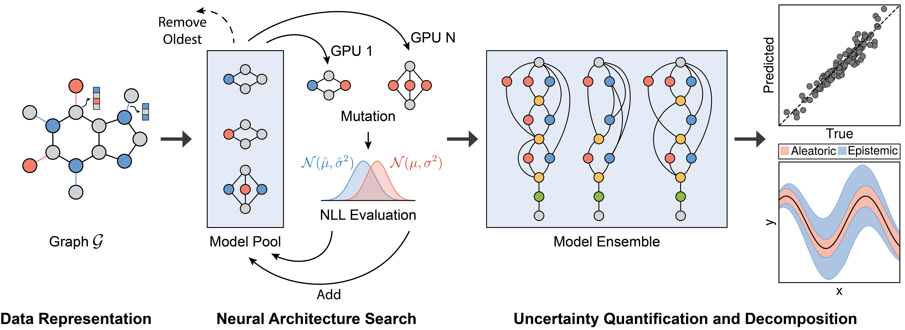

# Uncertainty Quantification for Molecular Property Predictions with Graph Neural Architecture Search

## ✨ Introduction
Graph Neural Networks (GNNs) have emerged as a prominent class of data-driven methods for molecular property prediction. However, a key limitation of typical GNN models is their inability to quantify uncertainties in the predictions. This capability is crucial for ensuring the trustworthy use and deployment of models in downstream tasks. To that end, we introduce AutoGNNUQ, an automated uncertainty quantification (UQ) approach for molecular property prediction. AutoGNNUQ leverages architecture search to generate an ensemble of high-performing GNNs, enabling the estimation of predictive uncertainties. Our approach employs variance decomposition to separate data (aleatoric) and model (epistemic) uncertainties, providing valuable insights for reducing them. In our computational experiments, we demonstrate that AutoGNNUQ outperforms existing UQ methods in terms of both prediction accuracy and UQ performance on multiple benchmark datasets. Additionally, we utilize t-SNE visualization to explore correlations between molecular features and uncertainty, offering insight for dataset improvement. AutoGNNUQ has broad applicability in domains such as drug discovery and materials science, where accurate uncertainty quantification is crucial for decision-making.
<br />

> Presentation

- 👉 [AIChE](https://drive.google.com/file/d/1DFC_-jh8x_qYjCub839b4cb4Fi4IlT6n/view?usp=sharing)

> Paper

- 👉 [arXiv](https://doi.org/10.48550/arXiv.2307.10438)


<br /> 

## ✨ AUTOGNNUQ Overview
<br />

<br />

## ✨ Implementation and Development

### Download Data
The data is publicly available at [here](https://drive.google.com/drive/folders/1lTG0aoY68D_yYBB7FCDlxpgmvPZbjW0u?usp=sharing).

```bash
$ git clone -b AUTOGNNUQ --single-branch https://github.com/zavalab/ML.git
$ cd ML/AUTOGNNUQ
$ pip install -e .
```

### Install Packages
```bash
python = 3.8
deephyper = 0.3.3
tensorflow = 2.5.0
tensorflow-probability = 0.13.0
ray = 2.0.1
```

### Code
`python train.py` runs neural architecture search for uncertainty quantification using multi-GPU support.

`python post_training.py` executes post-training with the top 10 architectures discovered.

### Data and Result Visualization
```bash
$ cd notebook
```