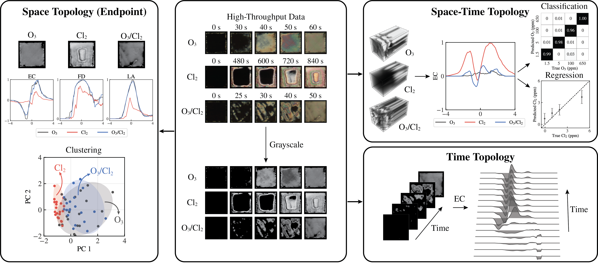

# Extracting Information from Complex Optical Responses of Chemoresponsive Liquid Crystals Using Topological Descriptors

## ✨ Introduction
Chemoresponsive liquid crystals (LCs) can be engineered to generate information-rich optical responses (in the form of space-time color and brightness patterns) when exposed to target gas contaminants. We investigate the use of topological descriptors (Euler characteristic, lacunarity, and fractal dimension) for extracting information from these complex optical responses and show that these tools can enable the design of sensors and help gain insights into phenomena governing such responses. We provide a holistic perspective of topological descriptors using theory of Minkowski functionals and fractal analysis, which allows us to understand specific information that each descriptor extracts. We also show how to use the descriptors in conjunction with space-time filtration operations and color representations to enrich the information extracted. We demonstrate how these capabilities can be used in flexible ways to facilitate unsupervised machine learning (ML) tasks (clustering and visualization) and supervised tasks (regression and classification). We demonstrate the developments using high-throughput experimental datasets for functionalized LC films that are exposed to different gaseous environments. We show that the topological descriptors encode significant information and can be used to detect outliers in high-throughput data and visualize the temporal evolution of topology. Moreover, we show that the topological descriptors can be used to predict contaminant concentrations using simple ML models such as support vector machines; notably, these ML models can achieve comparable accuracies to those of powerful convolutional neural networks but with a much lower computational cost and using less sophisticated computing hardware.
<br />

> Presentation

- 👉 [AIChE](https://drive.google.com/file/d/1mOjvkAu-worbBdP0FL9tz8Xhdgol1xuZ/view?usp=share_link)

<br />

## ✨ Topological Descriptors Overview
<br />

<br />

## ✨ Implementation and Development

```bash
$ git clone -b LC_TDA --single-branch https://github.com/zavalab/ML.git
$ cd ML/LC_TDA
$ pip install -e .
```

### TDA Training
```bash
$ cd lc_tda
$ python train_tda_so2rh.py
$ python train_tda_o3cl2.py
```

### CNN Training
```bash
$ cd lc_tda
$ python train_cnn_so2rh.py
$ python train_cnn_o3cl2.py
```

### Data and Result Visualization
```bash
$ cd notebooks
```