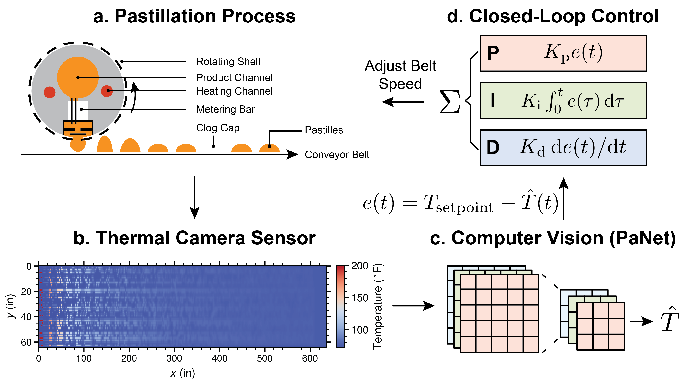

# PasNet
A Digital Twin Simulator of a Pastillation Process for Feedback Control based on Computer Vision



## Project Structure
```
Pastillation/
├── notebook/
│   ├── result.ipynb        # Results and figures
│   └── control.ipynb      # Feedback control examples
├── submit/           
│   ├── gen_data.submit    # Generate simulation data
│   └── train_cnn.submit   # Train vision model
├── pastillation/             
│   ├── analysis/          # Training analysis
│   ├── data/             # Data generation
│   └── model/            # Vision models
└── setup.py              # Package installer
```

## Installation
```bash
cd Pastillation
pip install -e .
```

## Usage
For HPC clusters:
```bash
cd submit
sbatch gen_data.submit    # Generate videos
sbatch train_cnn.submit   # Train model
```

For local development:
1. Set `idx = 0` and `max_idx = 1` in the following files
2. Run:
```bash
python pastillation/data/gen_data.py    # Generate data
python pastillation/model/train_cnn.py   # Train model
```