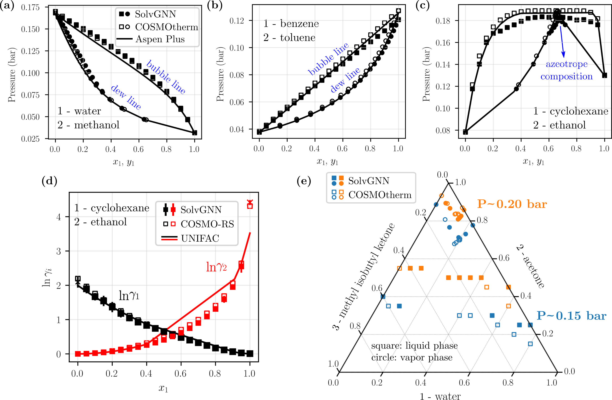
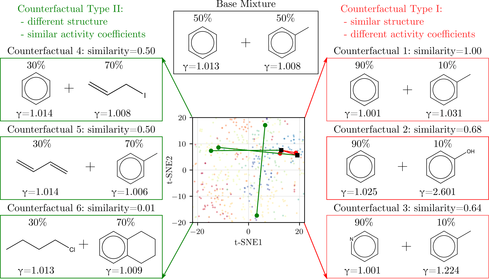

# Capturing Molecular Interactions in Graph Neural Networks: A Case Study in Multi-Component Phase Equilibrium (SolvGNN)

## ✨ Introduction

Here, we propose a **solvent GNN (SolvGNN)** architecture that captures molecular interactions in an explicit manner by combining *atomic-level (local)* graph convolution and *molecular-level (global)* message passing through a molecular interaction network. SolvGNN uses a graph representation wherein each node represents a molecule and each edge represents a potential intermolecular interaction (e.g., hydrogen bonding). We tested SolvGNN via a case study on **activity coefficient predictions for binary and ternary mixtures** using large data sets obtained from **COnductor-like Screening MOdel for Real Solvation (COSMO-RS)** calculations. We show that the proposed SolvGNN can predict composition-dependent activity coefficients with high accuracy. To interpret the trained model, we performed **counterfactual analysis** on SolvGNN to highlight the physical implications of chemical structures and compositions on the solvation behavior. Finally, we built a SolvGNN-based framework that takes a given mixture (binary or ternary) as input and generates the corresponding **phase diagrams (P-x-y)** using predicted activity coefficients coupled with phase equilibrium calculations.

SolvGNN is an open-source **computational framework and tool**. It can be directly used as tools to predict activity coefficients and/or generate phase diagrams; it can also be used for researchers and developers to train their own data sets and initiate future research.
<br />

> Features

- `Model training and validation framework` for SolvGNN
- `Activity coefficient predictions` at 298K for binary or ternary mixtures given their **SMILES strings**
- `phase diagrams (P-x-y) visualization` along with `phase equilibrium calculations`
- `Counterfactual analysis` to obtain physical insights
- `Large data sets availability` from COSMO-RS, containing **200,000** data records for binary mixtures and **160,000** data recordds for ternary mixtures

> Publication

- 👉 [Submitted Paper](https://doi.org/10.26434/chemrxiv-2022-3tq4c)

<br />

## ✨ SolvGNN Architecture

<br />

<br />

## ✨ Sample Output Showcase

<br />

> P-x-y Phase Diagram (VLE) at 298K


<<<<<<< HEAD
=======

> Conterfactual



<br />

## ✨ Implementation and Development

```bash
$ git clone -b SolvGNN --single-branch https://github.com/zavalab/ML.git
$ cd ML

#create a virtual environment
$ pip install -r requirements.txt

# alternatively (tested on Windows)
$ conda create -f environment.yml
$ conda activate solvgnn
```

## ✨ Tutorials

For detailed usage, navigate to the `notebook` directory.


## ✨ Links

- [Zavalab](https://zavalab.engr.wisc.edu/)
- [VanLehnGroup](https://vanlehngroup.che.wisc.edu/)
- [RDKit](https://github.com/rdkit/rdkit)
- [Deep Graph Library](https://www.dgl.ai/)

<br />
