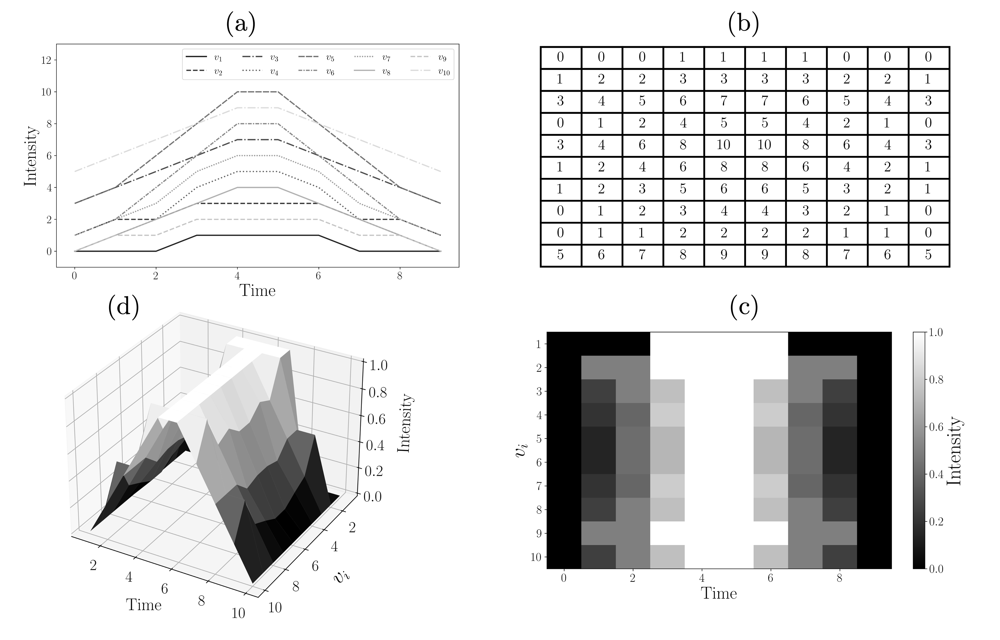

## Different Data Representations ENCODE Different Types of Information

Multivariate time-series data are typically represented as vectors and matrices, as needed by tools from statistics, linear algebra, and machine learning. However, modern tools of machine learning and data analysis can also process datasets that are represented as images, manifolds, point clouds, graphs, or networks. 

The data representation used influences the technique used for extracting information and the type of information extracted. 

The JuPyter notebook demonstrates how multivariate time-series data can be visualized in different forms:

(a) Raw time-series trajectories for process variables. 

(b) A matrix representation of the same data, where rows correspond to variable indices and columns to time steps.

(c) A heatmap visualization of the matrix, forming a 2D manifold whose pixel intensity reflects normalized process variables. 

(d) A 3D surface / field obtained by projecting intensities onto a third (vertical) axis, highlighting geometric structure (shape) in the data.

