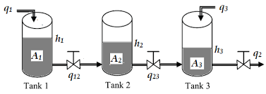
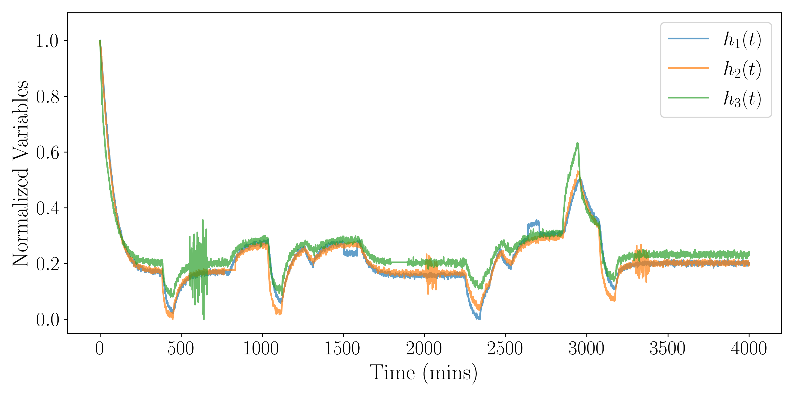
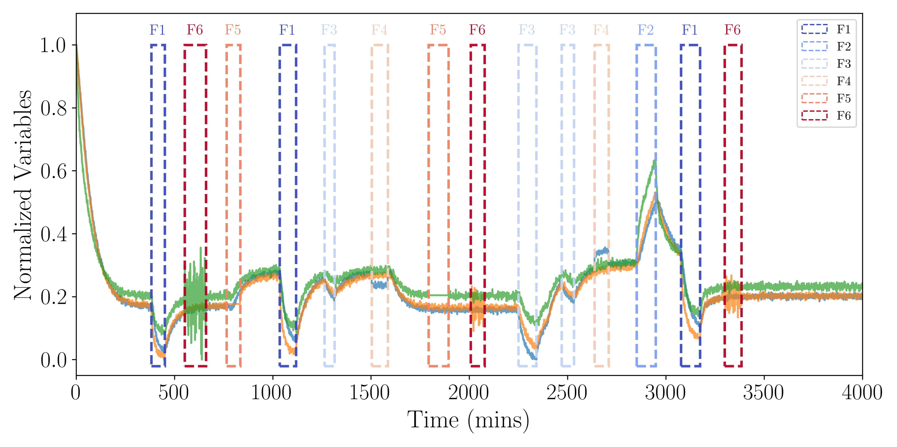

# Three-Tank System Multifault Synthetic Dataset

This folder contains an example synthetic dataset generated from a dynamic three-tank system (TTS) with transient process, actuator, and sensor faults. The dataset is intended for testing and demonstrating process monitoring, fault detection, event identification, and time-series analysis methods.

## Folder Contents

| File | Description |
|---|---|
| `data_generation_faults_TTS.ipynb` | Tutorial notebook describing the full synthetic data generation workflow, including the dynamic model, input profiles, fault schedule generation, measurement noise, sensor faults, and visualization. |
| `TTS_multifault_short_events.csv` | Main synthetic time-series dataset containing true states, measured variables, inputs, internal flows, and fault labels. |
| `TTS_fault_schedule.csv` | Fault schedule table containing event IDs, start/end times, fault types, and fault-specific parameters. |
| `TTS.png` | Schematic of the three-tank system. |
| `TTS_norm_time_series.png` | Normalized measured liquid-level trajectories without fault-window annotations. |
| `TTS_norm_time_series_fault.png` | Normalized measured liquid-level trajectories with transient fault windows overlaid. |

## System Description

The example considers a three-tank liquid-level process with inflows to tanks 1 and 3, inter-tank flows from tank 1 to tank 2 and from tank 2 to tank 3, and an outlet flow from tank 3.

The dynamic states are the liquid levels:

$$
x(t) =
\begin{bmatrix}
h_1(t) & h_2(t) & h_3(t)
\end{bmatrix}^T
$$

The manipulated variables are the inlet flow rates:

$$
u(t) =
\begin{bmatrix}
q_1(t) & q_3(t)
\end{bmatrix}^T
$$

The measured/controlled variables are:

$$
y(t) =
\begin{bmatrix}
h_1(t) & h_2(t) & h_3(t)
\end{bmatrix}^T
$$

The inlet flow rates $q_1(t)$ and $q_3(t)$ are specified as piecewise-constant inputs to generate nominal process transients. The measured liquid-level signals include Gaussian measurement noise and transient fault effects.

## Fault/Event Types

The generated dataset contains six labeled fault/event classes, denoted as F1--F6.

| Label | Fault/Event Type | Description |
|---|---|---|
| F1 | Process fault | Leak in tank 2. |
| F2 | Process fault | Clogging/restriction in the outlet valve from tank 3. |
| F3 | Actuator fault | Reduced efficiency of the actuator controlling $q_1$. |
| F4 | Sensor fault | Additive bias on a level sensor. |
| F5 | Sensor fault | Sensor freezes at a constant value. |
| F6 | Sensor fault | Increase in measurement noise variance. |

These events are generated as short transient faults separated by nominal operating periods.

## Dataset Description

The main dataset, `TTS_multifault_short_events.csv`, contains the following types of variables:

- simulation time,
- commanded inlet flow rates,
- true liquid levels,
- noisy measured liquid levels,
- true internal and outlet flow rates,
- binary fault activity labels,
- fault type labels,
- fault event IDs.

The fault schedule is stored separately in `TTS_fault_schedule.csv` to provide traceability between the labeled time-series data and the corresponding fault events.

## Example Time-Series Data

The normalized measured liquid-level trajectories are shown below.

The same trajectories with annotated F1--F6 fault windows are shown below.

## Reproducibility

The notebook `data_generation_faults_TTS.ipynb` provides the full tutorial and source code used to generate the dataset. Running the notebook regenerates the synthetic time-series dataset and the corresponding fault schedule.

## Intended Use

This example dataset can be used for:

- process monitoring,
- fault detection,
- transient event identification,
- benchmarking reconstruction-based and trajectory-based monitoring methods,
- demonstrating machine learning workflows for dynamic process systems.
