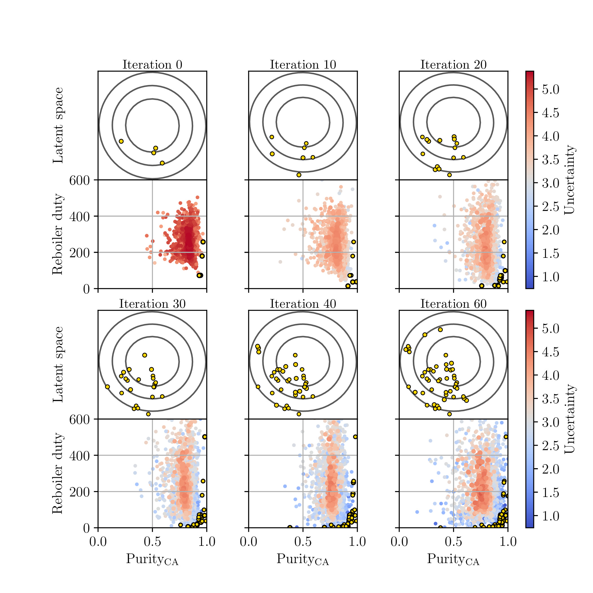
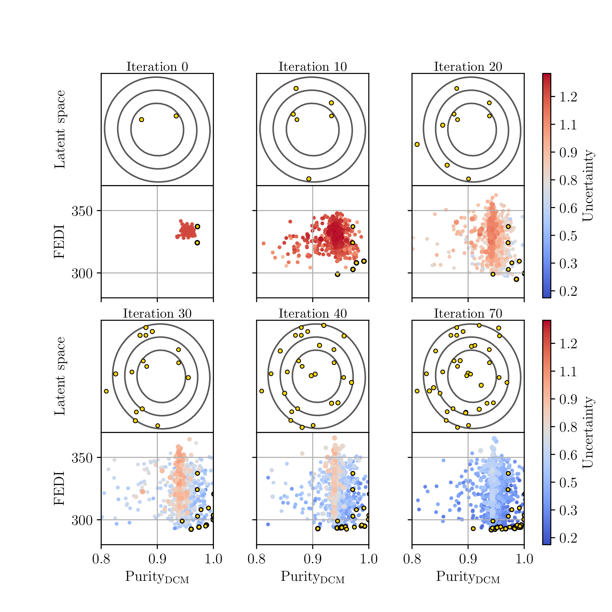

This repository comprises scripts used in the research paper titled 
'Simulation-Based Optimization over Discrete Spaces using Projection to Continuous Latent Spaces'.

## Introduction

This repositorie contains the Jupyter Notebooks to train a Variational AutoEncoder using a k-fold validation with the Optuna framework. Also, three additional Jupyter Notebooks show how to couple this model with Bayesian Optimization for single and multiobjective problems. The cases studies involve a simple reactor CSTR, the recovery of caprylic acid from water by liquid-liquid extraction, and the extraction of dichloromethane using a intensified column know as dividing wall column. 

 

With this, we provide a simulation-based optimization framework to optimize over discrete spaces using the simulator Aspen Plus. In this code is also shared the simulations and the metodology to conect Python with Aspen. 

> Publication

- [In Progress]
 

<!-- ## Sample Output

>   Evolution of the Gaussian Process models and Pareto frontier along the BO search for the caprylic acid recovery.

 

> Evolution of the Gaussian Process models and Pareto frontier along the BO search for the caprylic acid recovery.

 

 -->

## Tutorials

For detailed usage, navigate to the `Jupyter Notebooks` directory.

## Software Versions

- numpy  1.26.4
- pandas 2.2.3
- matplotlib 3.10.1
- botorch 0.11.0
- pytorch 2.2.1+cpu 
- pymoo  0.6.1.1

## Links

- [Scalable Systems Lab](https://zavalab.engr.wisc.edu/)

 